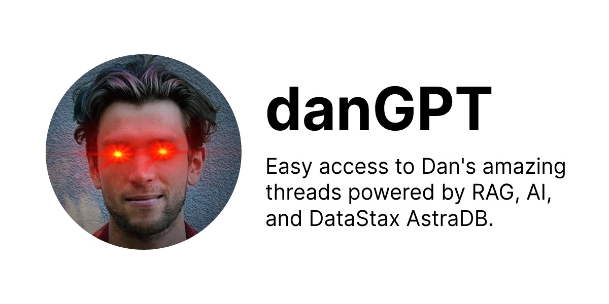

# danGPT

> Try it out at [https://dangpt.vercel.app/](https://dangpt.vercel.app).

This project showcases how to compose AI services and implement RAG (Retrieval Augmented Generation) with Generative AI.

Here's a breakdown of how it works:

1. Outside of the scope of this repo, we have scraped a huge amount of data. In this case, [Dan](https://x.com/dan_abramov2)'s posts.
2. We then turn all the text we'd like to search into vectors (lists of numbers) using a machine learning model that maps meaning in text to a multidimensional numerical space. "Embedding" the text in vector space using an ["embeddings model"](https://platform.openai.com/docs/models/embeddings). In this case, OpenAI's `text-embedding-3-small`.
3. We then store those vectors in a vector database. Our weapon of choice here is [AstraDB](https://astra.datastax.com/) from [DataStax](https://datastax.com/).

Then, when a user submits a query, we:

1. Turn the query into a vector using the same embeddings model.
2. Search the vector database for the most similar vectors to the query vector, or vectors "near" the query vector in dimensional space.
3. Retrieve many original texts from the most similar vectors.
4. Take those original texts and feed them as context into a generative AI model. In this case, OpenAI's `gpt-3.5-turbo`. The same model behind ChatGPT's free tier.
5. The generative AI model then generates a response based on the context it was given, prentending to be Dan.

It's worth noting that this is just a silly side project demo and is likely to be wrong. It's more for education than anything else.
